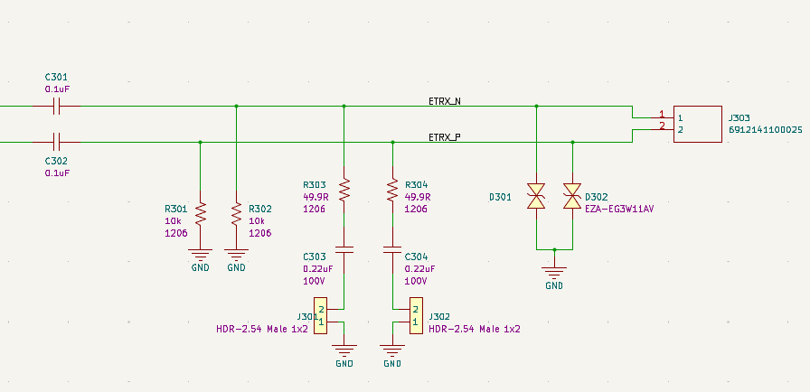

# 10BaseT1s Connections

The RAD-Meteor has a screw terminal block for connection to a 10BaseT1s Ethernet network (Figure 1). Also there are two jumpers to enable network termination.&#x20;

**TIP** : A 10BaseT1s network requires termination on the two end nodes of a network. Other nodes should have termination jumpers removed.

To help connecting wires, the terminal block silkscreen had the the text "P" to indicate bus positive and "N" for bus negative.

The schematic for the analog front end termination is shown in figure 2. This is the schematic as designed by the LAN867x PHY manufacturer ([Microchip](https://www.microchip.com) LAN86xx Bus Interface Network (BIN)).

<figure><figcaption>
Figure 1 - 10BaseT1s connector with Termination Jumpers
</figcaption></figure>

<figure><figcaption>
Figure 2 - 10BaseT1s termination network in RAD-Meteor.
</figcaption></figure>
