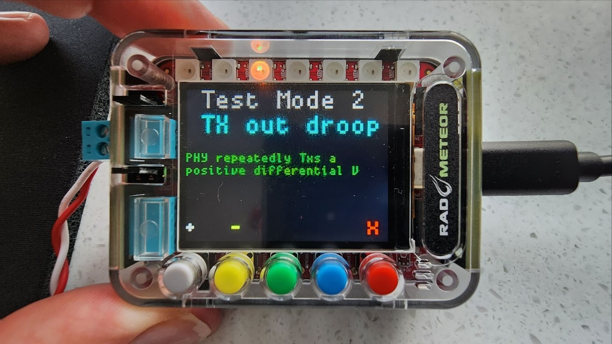

# 10BaseT1s Test Modes

The specification which defines 10BaseT1s ([IEEE Std 802.3cg](https://standards.ieee.org/search/?q=802.3cg)) specifies specific test mode wave forms to test the PHY. These can be enabled using RAD-Meteor.

## Using Buttons to use Test Modes

Press the gray button from the main screen to enter the test mode screens. Pressing the gray  button will enter test Mode 1. Cycle through the test modes by pressing the gray button (+) and yellow button (-). When done press the red button (X) to exit and return to normal operation (Test Mode Disabled).

<figure><figcaption>
Figure 1 - The Test Mode Entry screen
</figcaption></figure>
