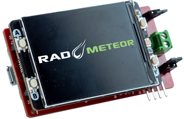

# RAD-Meteor

## Overview&#x20;

RAD-Meteor is a low cost device for interacting with 10BaseT1s ([IEEE Std 802.3cg](https://standards.ieee.org/search/?q=802.3cg)) networks.

<figure><figcaption>
RADMeteor v1 hardware
</figcaption></figure>

## Basic Features

* USB Network Adapter with 10BASE-T1S Physical Layer (PHY)
* Enumerates as standard Ethernet NIC in Linux or Windows.
* Monitor Ethernet with [Wireshark ](https://www.wireshark.org/)or [Vehicle Spy](https://intrepidcs.com/products/software/vehicle-spy/)
* TX/RX with socket applications
* Microchip LAN867X 10BASE-T1S PHY
* [Terminal Block](10baset1s-connections.md) with optional termination for T1S connections
* Device configuration and status register reporting over UDP
* 320 x 240 Color Display for [monitoring network and displaying status registers of MAC](display-main-screen/)
* 3 buttons for stand alone operations such as [10BASE-T1S test modes](10baset1s-test-modes.md) and [network setup](display-main-screen/display-setup-screens.md)
* [Field update of firmware](firmware-update/)

FW Revision 1 : [Device Release History](firmware-update/device-release-history.md)

[Specifications](specifications.md)
