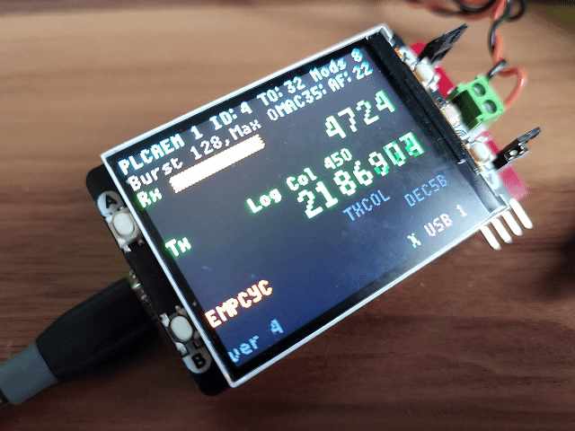

# RAD-Meteor

## Overview&#x20;

**Low cost device for interacting with 10BASE-T1s networks.**

Intrepid’s RAD-Meteor is a cost effective means to add a 10BASE-T1S ([IEEE Std 802.3cg](https://standards.ieee.org/search/?q=802.3cg)) port to your computer using USB. In addition to monitoring 10BASE-T1S traffic as if it were a standard Ethernet port, the RAD-Meteor network adapter supports the test modes and wave forms required to test the 10BASE-T1S network. RAD-Meteor also has a built-in full color display to view network activity and monitor the 10BASE-T1S status registers.

<figure><figcaption></figcaption></figure>

## Features

* USB Network Adapter with 10BASE-T1S Physical Layer (PHY)
* Enumerates as standard Ethernet NIC in [Linux ](using-on-linux.md)or [Windows](using-on-windows/).
* Monitor Ethernet with [Vehicle Spy](using-on-windows/using-in-vehicle-spy.md) or [Wireshark](https://www.wireshark.org/)
* TX/RX with socket applications
* Microchip LAN867X 10BASE-T1S PHY
* [Terminal Block](10baset1s-connections.md) with optional termination for T1s connections
* [Device configuration](host-usb-commands/) and [status register reporting](host-usb-commands/host-usb-responses.md) over USB Ethernet frames
* [Oscilloscope Trigger](oscilloscope-trigger.md) on bus events
* [Stand alone message generator](stand-alone-message-generator.md)
* 320 x 240 Color Display for [monitoring network and displaying 10BASE-T1S **** status registers](display-main-screen/)
* Stand-alone configuration of [10BASE-T1S parameters and test modes](10baset1s-test-modes.md) via 3-button interface
* &#x20;[Field updatable firmware](firmware-update/)

FW Revision see [Device Release History](firmware-update/device-release-history.md)

[Specifications](specifications.md)
