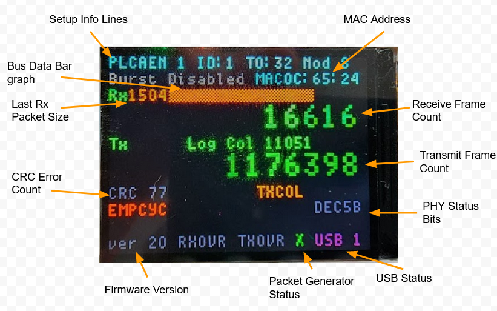
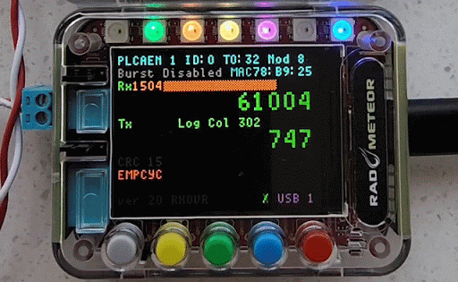

# Display: Main Screen

## Overview

The default screen for RAD-Meteor shows the setup and statistics of the T1s network. Figure 1 below shows the main screen.

<figure><figcaption>
Figure 1 - The Meteor main screen contains a lot of information about the state of the network.
</figcaption></figure>

##

<figure><figcaption></figcaption></figure>

## Buttons

There are 5 function buttons on the main screen. They are described in the topic below.&#x20;


[rad-meteor-button-indicators.md](../led-indicators/rad-meteor-button-indicators.md)


## Device Setup Information

The first two lines of the display show the device's setup.

| Caption | Description                                                                                                                                                                                                                                                                                                                                                                                                                                                                                                                                                                    | Notes                                                                                                                                                                                                                                                                                                                                   |
| ------- | ------------------------------------------------------------------------------------------------------------------------------------------------------------------------------------------------------------------------------------------------------------------------------------------------------------------------------------------------------------------------------------------------------------------------------------------------------------------------------------------------------------------------------------------------------------------------------ | --------------------------------------------------------------------------------------------------------------------------------------------------------------------------------------------------------------------------------------------------------------------------------------------------------------------------------------- |
| PLCA EN | Indicates if the PLCA feature is enabled.0 indicates The PLCA reconciliation sub-layer is disabled and the PHY operates in normal CSMA/CD mode without the performance enhancements of PLCA.                                                                                                                                                                                                                                                                                                                                                                                   |                                                                                                                                                                                                                                                                                                                                         |
| ID      | This field configures the node’s PLCA Local ID and the transmit opportunity within the PLCA cycle which it will transmit. A value of zero configures the node as the PLCA coordinator responsible for the periodic transmission of the PLCA BEACON and the number of transmit opportunities available per PLCA bus cycle. When set to 0xFF, the PLCA operation will be disabled and the node will revert to CSMA/CD                                                                                                                                                            | This parameter shall be configured unique across the multi-drop network to ensure proper collision-free operation.                                                                                                                                                                                                                      |
| TO      | Configures the PLCA Transmit Opportunity time allowed for each node to begin transmitting to capture the network. The time is represented in increments of 100 ns (i.e., 1 BT).                                                                                                                                                                                                                                                                                                                                                                                                | Important: This field must be configured identically across all nodes on the multidrop network. Improper configuration of Transmit Opportunity timer may result in reduced network performance or collisions. It is recommended to leave this field at its default value unless a full evaluation of network delays has been performed. |
| Nodes   | This field configures the maximum number of nodes supported on the multidrop network. Proper operation requires that this field be set to at least the number of nodes that may exist on the network. The number of transmit opportunities in a given PLCA cycle. Valid range: 0x01-0xFF                                                                                                                                                                                                                                                                                       | This field must be configured correctly on the node with ID=0                                                                                                                                                                                                                                                                           |
| Burst   | When burst mode is enabled, this field configures the amount of time allowed following the transmission of a frame which the node will continue to transmit and hold the multi-drop network waiting for the MAC to transmit an additional frame. Should the timer expire before the MAC transmits an additional frame, or if the maximum number of frames allowed to be transmitted in a single burst has been exceeded, the node will stop transmitting and yield the network to the next transmit opportunity. The time is represented in increments of 100 ns (i.e., 1 BT). | Note: The minimum value should be equal to the MAC inter-frame gap (IFG) plus margin for the latency between the MAC and PHY. IFG is 96 bit times for 10Mbit Ethernet.                                                                                                                                                                  |
| Max     | This field configures the maximum number of additional frames that the node may transmit in a single transmit opportunity. When set to 0, the PLCA burst mode is disabled and only one frame will be transmitted per transmit opportunity.r Burst how many frames allowed. 0 means burst is disabled                                                                                                                                                                                                                                                                           |                                                                                                                                                                                                                                                                                                                                         |
| MAC     | Lower 3 bytes of MAC address. The upper 3 bytes are Intrepid **00-FC-70**                                                                                                                                                                                                                                                                                                                                                                                                                                                                                                      |                                                                                                                                                                                                                                                                                                                                         |

## Transmit and Receive Statistics

The display indicates statistics on numbers sent and received by the device. They are in the table below.

| Caption              | Description                                                                                                                    | Notes                                                            |
| -------------------- | ------------------------------------------------------------------------------------------------------------------------------ | ---------------------------------------------------------------- |
| Rx Count             | The number of frames received by RAD-Meteor                                                                                    |                                                                  |
| Tx Count             | The number of frames transmitted by RAD-Meteor                                                                                 |                                                                  |
| Logical Col(lisions) | The number of transmits that were retried because of PLCA assertions of the COL (MII Collision Pin) indication                 | This is the normal function of PLCA and not an error             |
| Bus Data Bar graph   | This indicates how many network bytes have been received  over 100 ms time. It also indicates the size of the last RX packet.  | The maximum scale of bar- graph is the maximum bytes per 100 ms. |

## PHY Status Registers

The display shows information gathered by the PHY status registers. These items are detailed in the LAN867x data sheet from [Microchip](https://www.microchip.com). The text of each bit will be RED when they are active for the past half second, they will be orange if active in the past 5 seconds, they will turn gray if they have been active more than 5 seconds ago. They are in the table below:

| Caption       | Description                                                                                                                                                                            | Notes                                                                                                                                                                                                                                                                                                                              |
| ------------- | -------------------------------------------------------------------------------------------------------------------------------------------------------------------------------------- | ---------------------------------------------------------------------------------------------------------------------------------------------------------------------------------------------------------------------------------------------------------------------------------------------------------------------------------- |
| PLCA (active) | This field indicates that the PLCA reconciliation sublayer is active and a BEACON is being regularly transmitted or received.                                                          |                                                                                                                                                                                                                                                                                                                                    |
| CRC Errors    | This will count the number of messages received with a CRC error                                                                                                                       |                                                                                                                                                                                                                                                                                                                                    |
| EMPCYC        | This bit indicates an empty PLCA cycle                                                                                                                                                 | Common occurrence on a network that is not heavily loaded.                                                                                                                                                                                                                                                                         |
| TXCOL         | Physical collision on the network was detected                                                                                                                                         | Not a logical collision                                                                                                                                                                                                                                                                                                            |
| TXJAB         | This bit indicates the occurrence of a transmit jabber condition. A jabber condition occurs when the PHY detects that the PCS has remained in the transmit state longer than 2 ms.     |                                                                                                                                                                                                                                                                                                                                    |
| RXINTO        | This bit indicates the detection of another node transmitting in this node’s local assigned transmit opportunity. This could indicate multiple nodes being assigned the same Local ID. |                                                                                                                                                                                                                                                                                                                                    |
| UNEXPB        | When configured as the PLCA coordinator in charge of transmitting the periodic coordinating BEACONs, this bit indicates the detection of an unexpected BEACON on the segment.          | This condition may be due to the configuration of multiple PLCA coordinators on the segment.                                                                                                                                                                                                                                       |
| BCNBFTO       | This bit indicates the detection of a BEACON before the node’s assigned transmit opportunity.                                                                                          | This condition could indicate the configuration of multiple PLCA coordinators on the segment. Other conditions that may cause this to occur include a PLCA coordinator with an incorrectly configured maximum node count resulting in a PLCA cycle that is too short, or a PLCA Local ID that is configured beyond the PLCA cycle. |
| PLCASYM       | This bit indicates the detection of PLCA BEACON symbols when PLCA is not enabled.                                                                                                      | This condition may indicate the local node is operating with PLCA disabled on a segment with PLCA enabled nodes.                                                                                                                                                                                                                   |
| ESDERR        | This bit indicates the reception of an End-of-Stream Delimiter Error (ESDERR) or End-of-Stream Jabber (ESDJAB) symbol.                                                                 |                                                                                                                                                                                                                                                                                                                                    |
| DEC5B         | This bit indicates a 5B decoder encountered an unknown or reserved 5B codeword that could not be decoded.                                                                              |                                                                                                                                                                                                                                                                                                                                    |

## General Device information

The last line of the display indicates the firmware revision of RAD-Meteor and the USB connection status. It will also indicate FIFO overflow status(1 meaning connected)

| Caption                          | Description                                             | Notes                                    |
| -------------------------------- | ------------------------------------------------------- | ---------------------------------------- |
| ver                              | indicates firmware version number                       |                                          |
| USB                              | indicates if USB is connected to a host                 |                                          |
| RXOVR                            | indicates a receive  FIFO overflow                      | This is normal when USB is not connected |
| TXOVR                            | indicates a transmit FIFO overflow occurred             |                                          |
| toggles between **/** and **\\** | This indicates stand alone message generator is running |                                          |
