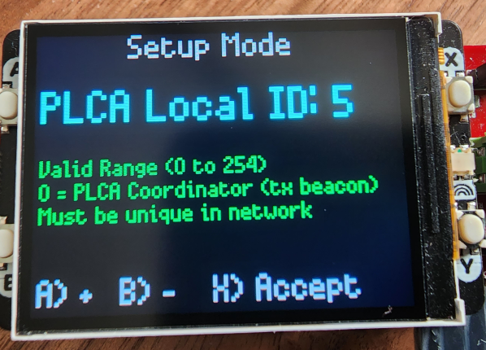

# Display: Setup Screens

When "x" is pressed from the [main screen](./) the device setup screens appear.&#x20;

These setup screens allow you to adjust the parameters below. These parameters are explained in the [main screen topic](./). Buttons A and B increment and decrement the parameter. X saves and moves to the next parameter. When all parameters are entered "X" will **save the settings into internal flash as the default power up settings**.

1. PLCA Enabled
2. PLCA Local ID
3. Node Count
4. Transmit Opportunity Timer
5. Max Burst for Burst Mode
6. Burst Timer

<figure><figcaption>
Figure 1 - Each setup parameter has a screen for adjustment along with helpful information.
</figcaption></figure>
