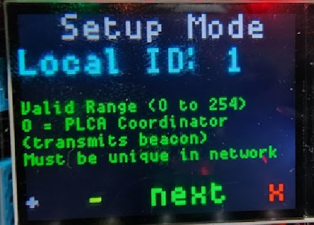

# Display: Setup Screens

When the green button is pressed from the [main screen](./) the device setup screens appear.&#x20;

These setup screens allow you to adjust the parameters below. These parameters without a description are explained in the [main screen topic](./). Buttons Gray (+) and Button Yellow (-) increment and decrement the parameter. The green button (next) saves and moves to the next parameter. When all parameters are entered the red button (x) will **save the settings into internal flash as the default power up settings**.

| Setting                                            | Description                                                                                          | Notes                                   |
| -------------------------------------------------- | ---------------------------------------------------------------------------------------------------- | --------------------------------------- |
| PLCA Enabled                                       |                                                                                                      |                                         |
| PLCA Local ID                                      |                                                                                                      |                                         |
| Node Count                                         |                                                                                                      |                                         |
| Transmit Opportunity Timer                         |                                                                                                      |                                         |
| Max Burst for Burst Mode                           |                                                                                                      |                                         |
| Burst Timer                                        |                                                                                                      |                                         |
| Oscilloscope[ Trigger](../oscilloscope-trigger.md) | Selection for trigger type                                                                           |                                         |
| Tx IFG                                             | Inter -frame gap for transmit messages                                                               |                                         |
| Tx Cnt                                             | Number of Transmits in the [packet generator](../stand-alone-packet-generator.md)                    |                                         |
| Delay                                              | Delay in micro seconds between packets in the [packet generator](../stand-alone-packet-generator.md) |                                         |
| Size                                               | Size of the packet in the [packet generator](../stand-alone-packet-generator.md)                     | Size = 0 generates a random size packet |
| Rate                                               | Line Rate setting in the [packet generator](../stand-alone-packet-generator.md)                      |                                         |
|                                                    |                                                                                                      |                                         |

<figure><figcaption>
Figure 1 - Each setup parameter has a screen for adjustment along with helpful information.
</figcaption></figure>
