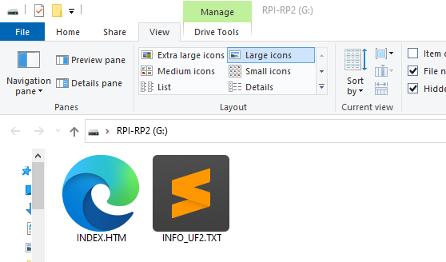

# Firmware Update

The RAD-Meteor supports a field update of firmware. This works on Linux, Windows and Mac.&#x20;

The current version of the firmware is shown on the [main screen](../display-main-screen/).

## Firmware Update Process

1\) Receive a UF2 FW file from [Intrepid support](https://intrepidcs.com/support/contact-support/)

2\) Hold the red button and plug in USB.&#x20;

3\) The host computer will show RAD-Meteor as a flash drive. Figure 2.

4\) Copy the UF2 file to the flash drive. Allow firmware to update.

5\) When done RAD-Meteor will disconnect from USB and reconnect as a USB NIC (normal operation)

**Note** If flash fails you can erase the flash using the nuke.uf2 file.  Just follow the above steps using the the nuke.uf2. Then re-flash with the RAD-Meteor UF2 file. This will also erase any default settings.



<figure><figcaption>
Figure 2 - The boot-loader is presented as a USB drive.
</figcaption></figure>
