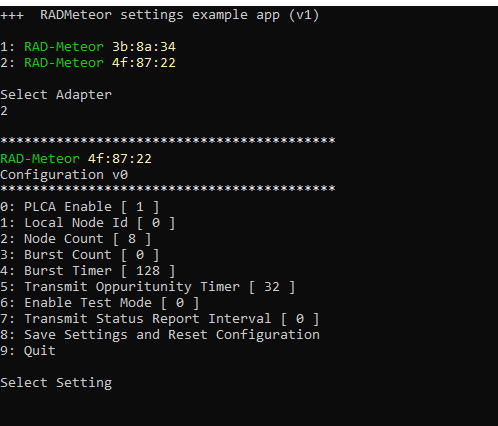

# Host USB Commands

**NOTE : This topic may change significantly based on further review and testing.**

## Overview

The RAD-Meteor has the ability to receive commands over the normal Ethernet data stream. RAD-Meteor will intercept host messages targeted to the MAC Address **00:FC:70:1C:00:00.** These Ethernet frames are processed by RAD-Meteor and discarded (they are not sent on the T1s bus).

Similarly RAD-Meteor will send responses or status using this same mac address.

Please see the RAD-Meteor settings project on GitHub to use as an example app (Figure 1).&#x20;

## Settings App Example

The RAD Meteor example settings app is an open source app from Intrepid. The Windows App is below. You need to install [WinPCAP ](https://www.winpcap.org/install/)for this to work.



<figure><figcaption>
Figure 1 - The settings example is a winpcap application that sends the settings host command.
</figcaption></figure>

## Commands

The data payload begins at 42 bytes. The first two bytes of the payload are the command in big endian format (AA is the first byte).  The command's data begins right after the command (44 bytes). The table below lists the commands.&#x20;

| Command                      | ID     | Notes |
| ---------------------------- | ------ | ----- |
| HOST\_COMMAND\_SET\_SETTINGS | 0xAA01 |       |
|                              |        |       |

## Settings Command

The settings command allows you to set the device settings from the host. You can optionally have them saved as the power up default. The settings example app uses this command - please reference this app for an example. The settings are the same as described in the [Main Screen topic](../display-main-screen/).

The payload bytes not used should be set to zero for future compatibility.

**Note** The defaults are stored in flash memory and are not meant to be updated 1000's times a day as might happen in a tester application. So do not save settings to flash if its not necessary. The flash typical endurance is 100k writes.

**Command: 0xAA01**

**Data**

| Position                                 | ID | Notes                                                                                                 |
| ---------------------------------------- | -- | ----------------------------------------------------------------------------------------------------- |
| HOST\_SETTING\_PLCA\_ENABLE              | 0  | 1 to enable, 0 Disable                                                                                |
| HOST\_SETTING\_PLCA\_LOCAL\_ID           | 1  |                                                                                                       |
| HOST\_SETTING\_BUS\_NODE\_COUNT          | 2  |                                                                                                       |
| HOST\_SETTING\_MAX\_BURST\_CNT           | 3  |                                                                                                       |
| HOST\_SETTING\_BURST\_TIMER              | 4  |                                                                                                       |
| HOST\_SETTING\_TX\_OPP\_TMR              | 5  |                                                                                                       |
| HOST\_SETTING\_TEST\_MODE                | 6  | 0 = enter normal mode, 1-4 = [Test Modes](../10baset1s-test-modes.md) (Not saved in flash as default) |
| HOST\_SETTING\_STATUS\_INTERVAL\_LSB     | 7  | Bytes 7 and 8 are 16 bit value for reporting register status in milliseconds. 0 = disabled            |
| HOST\_SETTING\_SAVE\_SETTINGS\_TO\_FLASH | 9  | 1 = update as power up defaults, 0 = do not update.                                                   |
| HOST\_SETTING\_OSCOPE\_TRIGGER           | 10 | 0 = disabled, [x is scope trigger](../oscilloscope-trigger.md)                                        |

