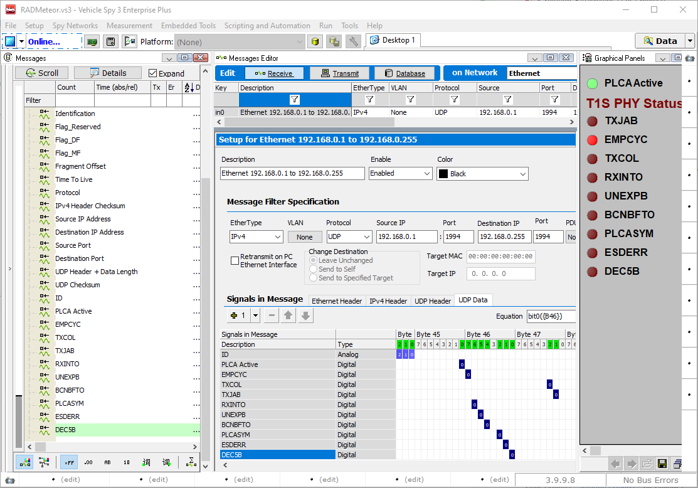

# Host USB Responses

## Overview

The RAD-Meteor can generate Ethernet frames that occur across the USB interface only for device status. ThThese can be used by the host to provide additional information about the T1s network. For example the status message contains status information like on the [main screen](../display-main-screen/).


Vehicle Spy Setup File to decode status messages


<figure><figcaption>
Figure 1 - Analyzers like Vehicle Spy can decode Ethernet frame data such as the status message.
</figcaption></figure>

## Responses

The data payload begins at 42 bytes. The first two bytes of the payload are the response id in big endian format (55 is the first byte).  The response's data begins right after the command (44 bytes). The table below lists the responses.

| Response                   | ID     | Notes |
| -------------------------- | ------ | ----- |
| HOST\_RESPONSE\_STATUS\_ID | 0x5501 |       |
|                            |        |       |
|                            |        |       |

## Status Response&#x20;

&#x20;The status response is sent on a interval when commanded by Settings command. It contains device status such as PHY settings, Network statistics, and device performance.

| Position                                     | ID | Encoding               | Notes           |
| -------------------------------------------- | -- | ---------------------- | --------------- |
| HOST\_RESPONSE\_STATUS\_PLCA\_ACTIVE         | 0  | bit                    |                 |
| HOST\_RESPONSE\_STATUS\_PLCASTATUS1          | 1  | little endian bitfield | See below       |
| HOST\_RESPONSE\_STATUS\_PLCASTATUS2          | 3  |                        | Not Implemented |
| HOST\_RESPONSE\_STATUS\_PLCASTATUS3          | 5  |                        | Not Implemented |
| HOST\_RESPONSE\_STATUS\_BEACON\_COUNT        | 7  | uint32                 |                 |
| HOST\_RESPONSE\_STATUS\_TX\_OPPORTUNITY\_CNT | 11 | uint32                 |                 |
|                                              |    |                        |                 |
|                                              |    |                        |                 |
|                                              |    |                        |                 |

<figure><figcaption>
Figure 2 - PLCA Status bits reported in status 1.
</figcaption></figure>
