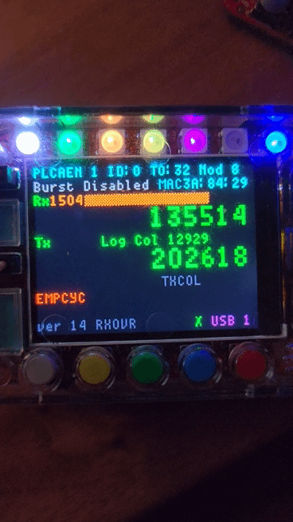

# LED Indicators

## Overview

The RAD-Meteor has 7 LEDs that show status of the network and the device. The function of these LEDs are listed below:

| LED | Color      | Description                                                                                         |
| --- | ---------- | --------------------------------------------------------------------------------------------------- |
| 1   | White      | Flashes when the Trigger it activated                                                               |
| 2   | Green      | Lit when PLCA is active                                                                             |
| 3   | Orange     | Lit when Packet generator is active                                                                 |
| 4   | Yellow     | Flashes when packets are received                                                                   |
| 5   | Purple     | Flashes when packets are transmitted                                                                |
| 6   | Red        | Flashes when CRC Errors or Tx Collision errors are present. Cleared with RED button on main screen. |
| 7   | Green/Blue | Flashes on USB Transmit or Receive                                                                  |

<figure><figcaption></figcaption></figure>
