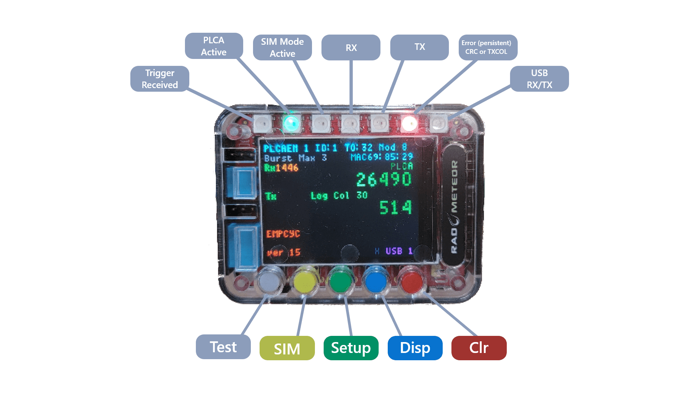

# RAD-Meteor Button Indicators

The following RAD-Meteor User Interface shows the Button Indicators.

<figure><figcaption></figcaption></figure>

Note - Some LEDs are redundant with GUI

#### Buttons enter menu system

<table data-full-width="true"><thead><tr><th width="283" align="center">Buttons Indicators</th><th>Description</th></tr></thead><tbody><tr><td align="center"></td><td><strong>Enabling IEEE Test Modes (White)</strong></td></tr><tr><td align="center"></td><td><strong>Enabling Node Sim Modes (Yellow)</strong></td></tr><tr><td align="center"></td><td>
<strong>Setup -</strong> 
<ul><li><strong>PLCA Configuration</strong></li><li><strong>Scope Triggers</strong></li><li><strong>Sim Mode Configuration</strong></li></ul></td></tr><tr><td align="center"></td><td>

<strong>Cycle through Display Modes</strong>
</td></tr><tr><td align="center"></td><td><strong>Clear statistics, error LED, and persistent indicators</strong></td></tr></tbody></table>

Inside menus, button context is displayed on the screen.
