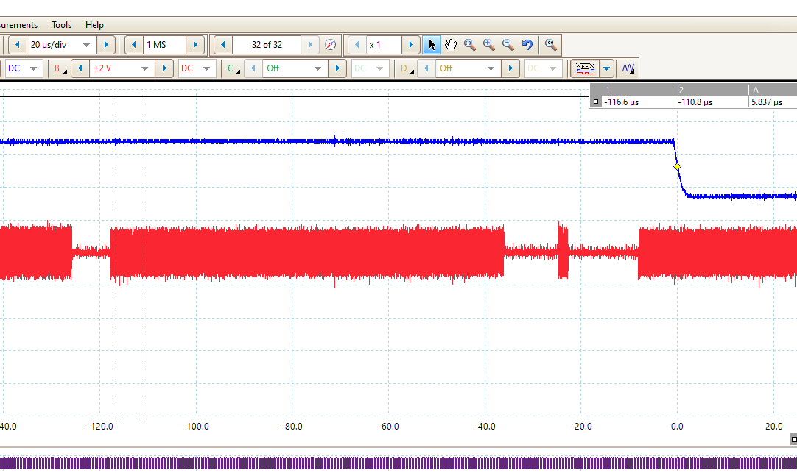
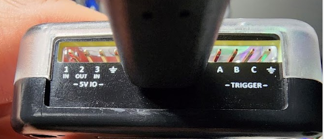

# Oscilloscope Trigger

## Overview

The Oscilloscope trigger is a function that can generate a pulse to an external test device when specific events happen. This feature is useful for monitoring bus events that occur intermittently. This is especially important in 10 BaseT1s because the Beacon is periodically transmitted - this makes it difficult to use a scopes traditional triggering mechanisms.

<figure><figcaption>
Figure 1 - The Oscilloscope Trigger is a falling edge trigger when an event happens.
</figcaption></figure>

## Trigger Connection

On RAD-Meteor hardware you can connect to the trigger by attaching a wire to the trigger A signal as shown below. The trigger voltage is a 3.3V output that will go low when the trigger appears. It will automatically rearm after 5 microseconds or less.

<figure><figcaption>
Figure 2 - The blue wire shown connects to the trigger pin GP20.
</figcaption></figure>

## Trigger Options

The RAD-Meteor currently supports the following triggers listed below. The Trigger is configured on the [setup screens](display-main-screen/display-setup-screens.md).

| Trigger         | Description                                      | Notes                                                        |
| --------------- | ------------------------------------------------ | ------------------------------------------------------------ |
| CRC Error       | received message had an invalid CRC              | occurs after message received in total                       |
| Logic Collision | A transmit was attempted but blocked by the PLCA | occurs after COL on MII occurs                               |
| Any Rx          | Any received message                             | occurs after message received in total                       |
| Any Tx          | Any successfully transmitted message             | occurs after the message is successfully transmitted         |
| Bus Collision   | Physical bus collision - TxCol status bit        | happens when [TxCol status bit](display-main-screen/) is set |
| Runt Frame      | A runt frame was received                        | A runt frame is a frame under 64 bytes                       |
