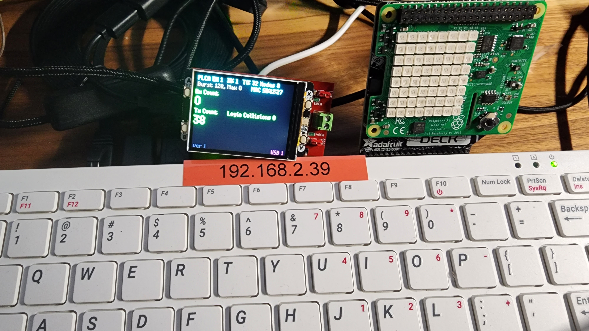
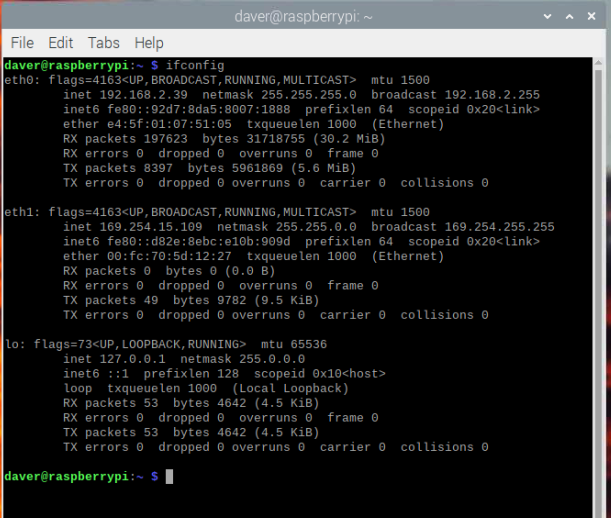

# Using on Linux

## Overview

RAD-Meteor enumerates as a NIC on Linux. Plug in and use like any other Ethernet Interface. The RAD-Meteor will be listed in "ifconfig" with a MAC address starting with Intrepid's OUI (00:FC:70).

<figure><figcaption>
Figure 1 - RAD-Meteor sending frames from a Raspberry Pi 400
</figcaption></figure>

<figure><figcaption>
Figure 2 - RADMeteor showing up as ETH1 in ifconfig. Intrepid MAC Prefix/OUI 00:FC:70.
</figcaption></figure>
