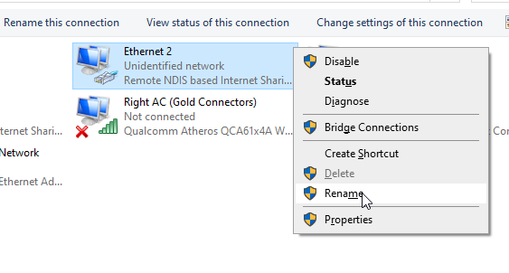
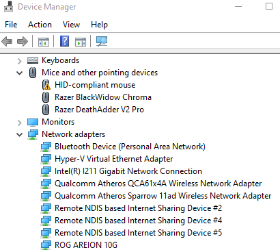
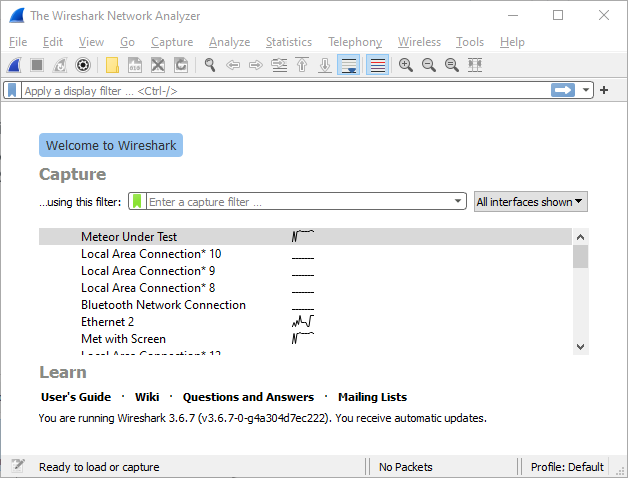

# Using on Windows

## Overview

When plugged into a Windows PC the RAD-Meteor will show as a USB NIC. No special driver is required.

It is recommended to change the NIC name so it is easier to use. It normally shows up as something like "Ethernet X" where X is a number. It will also be referenced as a "Remote NDIS based Internet sharing device" for example in device manager (Figure 2). After naming it you can more easily identify it in Vehicle Spy or Wireshark. This is even more important if you have multiple RADMeteors connected to your PC.

You can identify the MAC address from the [main screen](../display-main-screen/) or the [settings app](../host-usb-commands/).

Follow these steps to change the name:

* Press Windows Key + X
* Press “W” or left click on “Network Connections”
* Click on “Change adapter options”

<figure><figcaption>
Figure 1 -Change the name of your NIC in Windows Network Connections so its easier to use.
</figcaption></figure>

<figure><figcaption>
Figure 2 - RAD-Meteor shows as a Remote NDIS device in Windows Device manager
</figcaption></figure>

<figure><figcaption>
Figure 3 - The "Meteor Under Test" custom name is shown in Wireshark.
</figcaption></figure>

<figure><figcaption>
Figure 4 - The "Met with screen" custom name shown in Vehicle Spy
</figcaption></figure>
