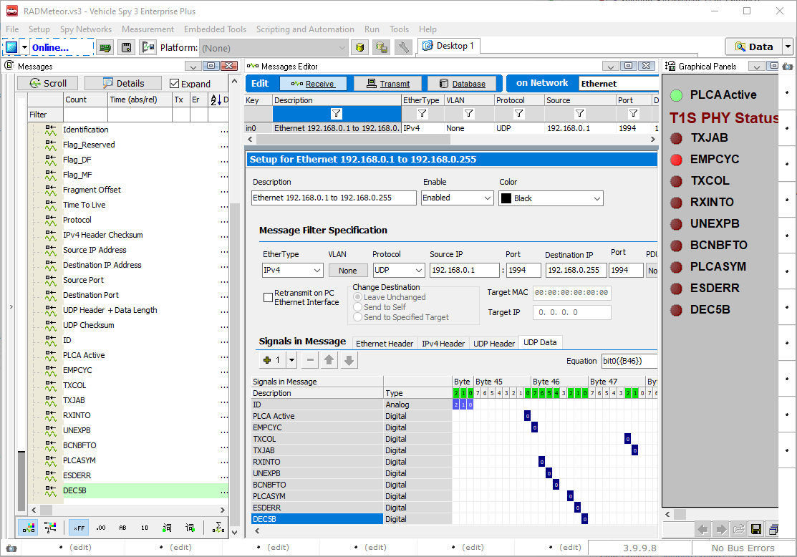
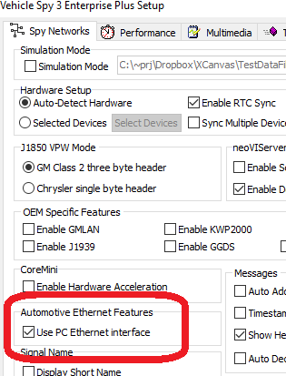
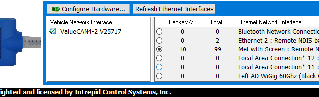

# Using in Vehicle Spy

## Overview

Vehicle Spy from Intrepid contains many features for analyzing Ethernet networks that exceed that of Wireshark. This includes being able to transmit ethernet frames, scripting, simulate ecus and gateways, and decode protocols with OEM databases.

<figure><figcaption>
Figure 1 -  Vehicle Spy software for transmit and receiving Ethernet.
</figcaption></figure>

## Setting up Vehicle Spy

First its recommend to give your RAD-Meteor a custom name as described in [Windows setup](./).

To use vehicle spy you must have a license hardware such as ValueCAN to use RADMeteor. After this you need to select "Use PC Ethernet interface" from the setup menu form Tools->Options.

<figure><figcaption>
Figure 1 - Use must enable Ethernet NIC feature of Vehicle Spy to use a NIC
</figcaption></figure>

Next you have to enable the correct NIC from the logon screen. The Ethernet interfaces are listed in the lower left corner (Figure 2). You can only connect to one Ethernet NIC at a time.

<figure><figcaption>
Figure 2 - Here the RAD-Meteor "Met with Screen" is selected.
</figcaption></figure>
